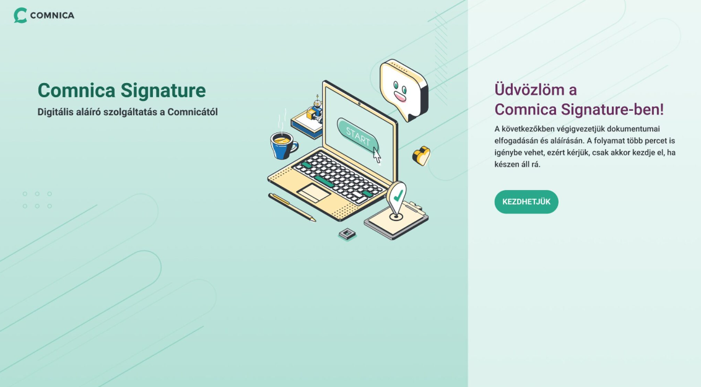
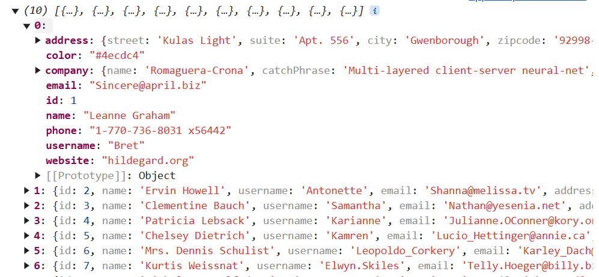
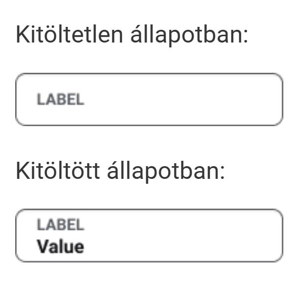

# Feladatok és Válaszok

Ebben a dokumentumban a különböző feladatokra adott válaszok találhatók. Kérlek, olvasd végig a leírásokat és a megoldásokat, mivel ezek segíthetnek a projekt teljes megértésében és végrehajtásában.

## Task 1:
Az alábbi kép alapján készítsd el a felületet AngularJS, hyperapp vagy React framework használatával és töltsd fel valahova, vagy küldd vissza e-mailben!

a) logót, az illusztrációt valamint a háttérhez használt képet tetszőlegesen helyettesítsd be

b) betűtípus: Roboto

c) színkódok:

#31363c
#29a98b; #20876f; #186553;
#682c5d
d) a gombot lehetőség szerint szervezd ki egy komponensbe, illetve kattintásra írjon valamit a console-ra

e) minden más (elhelyezés, méretezés, margin, padding…stb.) rád van bízva, légy kreatív és munkádra igényes! slightly smiling face

## Task 2: 
Adott egy gomb. Elvileg minden rendben kód szinten, mégsem csinál semmit se hover, se egyéb eseményre (nem disabled). Mi lehet a probléma, mi okozhat ilyen jelenséget?

**Válasz:**  

A gombon vagy a szülőelemén olyan CSS beállítások lehetnek, amelyek letiltják az interaktivitást, például ``pointer-events: none;``, ami megakadályozza a gomb használatát.

## Task 3:
Írj egy tetszőleges JS funkciót, ami lekér egy felhasználó listát egy képzeletbeli API-ról, majd miután ezt sikerrel megtette, lekér egy szín listát, majd miután ez is sikerült, egy tetszőleges színt rendel a 1-1 felhasználóhoz és így adja vissza a felhasználók listáját. Hiba esetén a console-ra ír illetve eredménytől függetlenül a console-ra írja, ha végzett.

**Válasz:**  

A "Kezdhetjük" gombra kattintva végbemegy a funkció, és kiírja a választ a console-ba.

## Task 4:
A designer a következőképpen álmodja meg a beviteli mező működését:

Mi lehet ezzel a működéssel az általános probléma?

**Válasz:**  

Az ilyen floating label inputokkal az általános probléma, hogy a felhasználók azt hihetik, hogy a mező már ki van töltve, holott üres. Továbbá, akadálymentességi problémát okozhat a látásérültek számára.

---
---
---
---
---

# ComnicaFrontendTestTask

This project was generated with [Angular CLI](https://github.com/angular/angular-cli) version 18.1.2.

## Development server

Run `ng serve` for a dev server. Navigate to `http://localhost:4200/`. The application will automatically reload if you change any of the source files.

## Code scaffolding

Run `ng generate component component-name` to generate a new component. You can also use `ng generate directive|pipe|service|class|guard|interface|enum|module`.

## Build

Run `ng build` to build the project. The build artifacts will be stored in the `dist/` directory.

## Running unit tests

Run `ng test` to execute the unit tests via [Karma](https://karma-runner.github.io).

## Running end-to-end tests

Run `ng e2e` to execute the end-to-end tests via a platform of your choice. To use this command, you need to first add a package that implements end-to-end testing capabilities.

## Further help

To get more help on the Angular CLI use `ng help` or go check out the [Angular CLI Overview and Command Reference](https://angular.dev/tools/cli) page.
